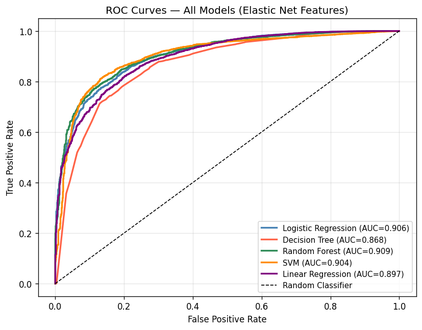
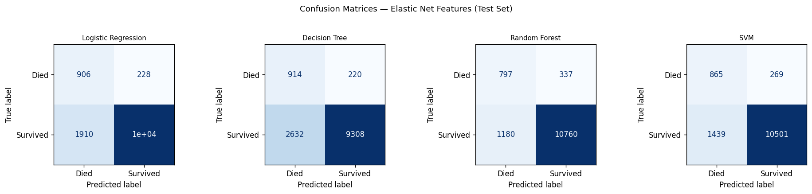
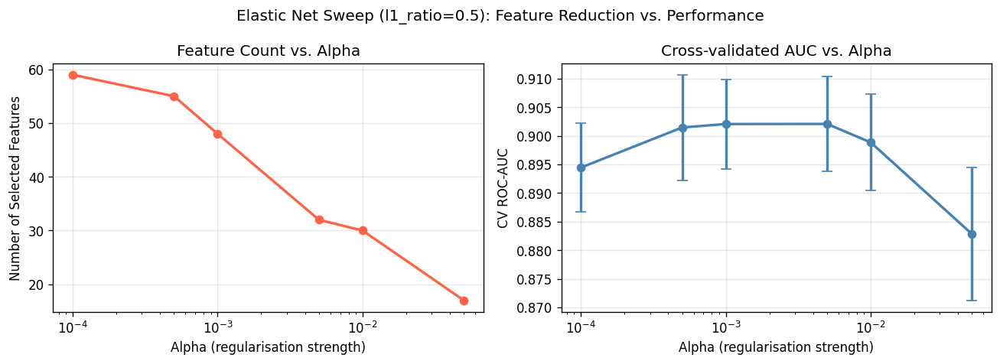
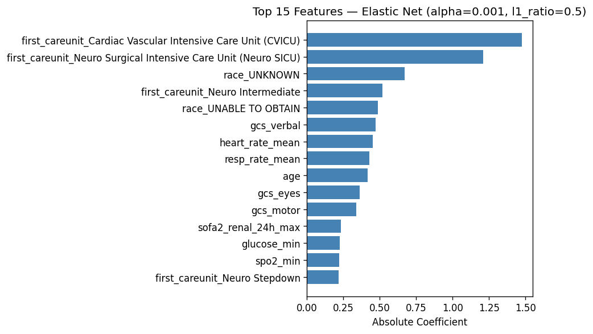

## ICU Discharge Prediction Portfolio

## 🚀 Overview
This project applies **machine learning to real ICU patient data (MIMIC-IV)** to predict whether a patient will be discharged alive or die during their ICU stay.  
The goal is to support **critical care decisions** and **optimize hospital resource allocation**.

**Best model: Random Forest — ROC-AUC 0.909, F1 0.934**

---

## 🎯 Motivation
- ICU beds are scarce and costly; premature discharge risks patient deterioration, while delayed discharge wastes resources.  
- Predictive models can help clinicians balance safety and efficiency.  
- This project demonstrates how structured EHR data can be transformed into actionable insights.

---

## 📊 Dataset
- **Source:** [MIMIC-IV](https://physionet.org/content/mimiciv/) (de-identified EHR, Beth Israel Deaconess Medical Center)  
- **Size:** 65,000+ ICU patient records  
- **Target:** `icu_discharge_flag` (1 = discharged alive, 0 = died)  
- **Class distribution:** ~91% discharged, ~9% died (imbalanced)

---

## 🛠️ Methodology
1. **Preprocessing**: imputation, scaling, one-hot encoding → 223 features  
2. **Feature filtering**: missingness, variance, correlation → 69 features  
3. **Elastic Net selection**: α = 0.01 → 30 clinically meaningful features  
4. **Models compared**: Random Forest, Logistic Regression, SVM, Decision Tree, Linear Regression  

**Key selected features:** ICU unit type, GCS subscores, mean heart rate, respiratory rate, age, renal SOFA score, glucose, SpO₂.

---

## 📈 Results

| Model | Accuracy | F1 | ROC-AUC |
|-------|----------|----|---------|
| **Random Forest** | 0.884 | **0.934** | **0.909** |
| Logistic Regression | 0.837 | 0.904 | 0.906 |
| SVM (RBF) | 0.869 | 0.925 | 0.904 |
| Decision Tree | 0.782 | 0.867 | 0.868 |

---

## 📊 Visualisations

### ROC Curves


### Confusion Matrices


### Elastic Net Sweep


### Feature Importance


---

## 📂 Repository Structure
```
├── elastic_net_pipeline_github.py   # ML pipeline
├── outputs_en/                      # Plots & results
│   ├── roc_curves_en.png
│   ├── confusion_matrices_en.png
│   ├── en_sweep.png
│   ├── en_coefficients.png
│   └── model_results_en.csv
├── requirements.txt
├── LICENSE
└── README.md
```

---

## ⚡ How to Run

### 1. Clone the repository
```bash
git clone https://github.com/Aaditya-Jain-01/ICU-Discharge-Prediction-Portfolio.git
cd ICU-Discharge-Prediction-Portfolio
```

### 2. Install dependencies
```bash
pip install -r requirements.txt
```

### 3. Add your MIMIC-IV dataset
- Requires credentialed PhysioNet access: [MIMIC-IV](https://physionet.org/content/mimiciv/)  
- Place `Assignment1_mimic dataset.csv` in the root directory

### 4. Run the pipeline
```bash
python elastic_net_pipeline_github.py
```

### 5. (Optional) Run SQL analysis
```bash
python mimic_sql_analysis.py
```


---

## 🔍 Key Insights
- Random Forest achieved the best balance of recall and precision.  
- Logistic Regression produced fewer false positives — important for clinical safety.  
- SQL analysis revealed mortality patterns by ICU unit, age, gender, and insurance type.  
- Surgery/Trauma units had the highest mortality (42.86%).  

---

## 📌 Future Work
- Temporal modelling with patient trajectories (time-series vitals).  
- Probability calibration for deployment.  
- Gradient boosting (XGBoost/LightGBM) comparison.  
- SHAP values for patient-level explainability.  

---

## 👨‍💻 Author
**Aaditya Jain (2026)**  

---
## 📜 License
This project is licensed under the MIT License – see the LICENSE file for details.  
